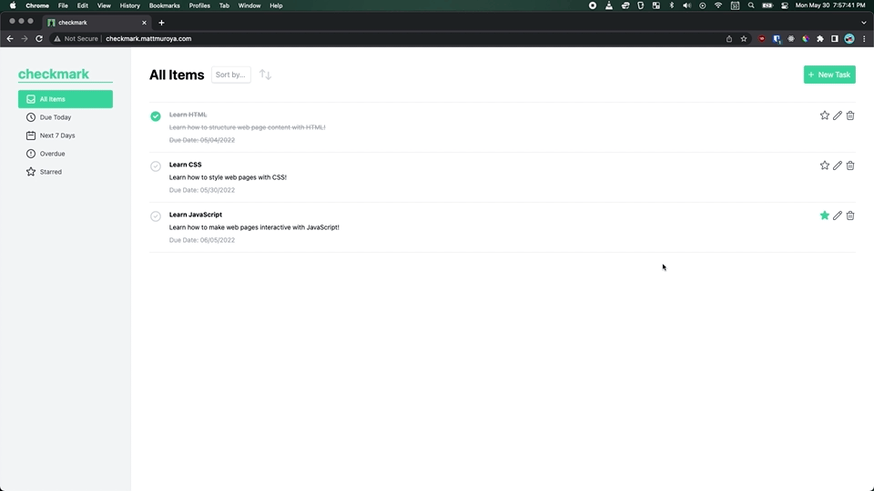

# Checkmark

Checkmark is a basic task manager that allows you to create, filter, sort, and mark your tasks completed, as well as edit and delete them.

Try it out! https://checkmark.mattmuroya.com

## Highlights

- Written entirely in vanilla JavaScript/HTML and developed/bundled using [webpack](https://webpack.js.org/).
- Demonstrates object-oriented programming (OOP) principles, modular architecture, factory functions, getters/setters, and vanilla JS event handling and DOM manipulation.
- Task data saved to localStorage and sorted/filtered according to title and/or due date.
- Fully responsive mobile-first design styled using [TailwindCSS](https://tailwindcss.com/).

## Development Challenges

- There are a lot of small details that can be easy to overlook when it comes to user experience (UX). For example: If a user is viewing the "Starred Tasks" page, and then adds a new task that is NOT starred - how should the application behave? You need some form of visual feedback that indicates the save is successful. Should it take the user back to "All Items?" How can you keep this behavior consistent across all pages and potential user actions?
